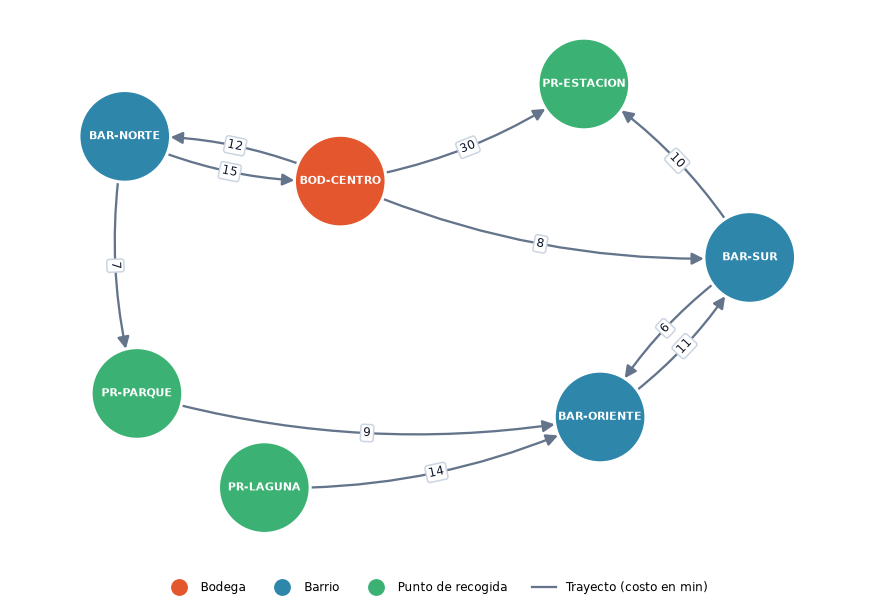

# RutaPyme — Red operativa de entregas

Microproducto para la materia **Matemáticas para la Informática Avanzada** · Equipo 7
**Integrantes:** **Emmanuel Cardona**, **Sebastian Ramirez**, **Juliana Velandia**

RutaPyme coordina entregas entre una bodega, barrios y puntos de recogida. Hoy decide "a ojo" y a
veces envía pedidos por conexiones cerradas. Esta herramienta modela su red como un
**grafo dirigido y ponderado propio**, lo expone con una **API REST en Python** y lo muestra en una
**interfaz web** conectada a esa API.

| Feature | Estado | Descripción |
|---------|--------|-------------|
| 1 · Red operativa inicial | 🚧 En construcción | Registrar y consultar puntos y trayectos |
| 2 · Cobertura de entregas | ⏳ Pendiente | ¿Qué destinos alcanzo desde una bodega? |
| 3 · Ruta de menor costo | ⏳ Pendiente | Ruta más barata entre dos puntos |
| 4 · Operación demostrable | ⏳ Pendiente | Integración, cambio de requisito y demo |

---

## 1. Instalación

Requisitos: **Python 3.12 o superior** y Git.

```bash
git clone <URL-del-repositorio>
cd <nombre-del-repositorio>
python -m venv .venv
```

Activar el entorno virtual:

```bash
# Windows (PowerShell)
.venv\Scripts\Activate.ps1
# macOS / Linux
source .venv/bin/activate
```

Instalar dependencias (solo NetworkX y su motor de dibujo, ver sección 6):

```bash
pip install -r requirements.txt
```

## 2. Ejecución

```bash
python main.py              # red vacía
python main.py --ejemplo    # red sintética de datos/red_ejemplo.json
```

Abrir **http://127.0.0.1:8000** en el navegador. La misma dirección sirve la interfaz y la API.

Opciones: `--puerto 8080`, `--host 0.0.0.0`. También se leen las variables de entorno `PORT` y `HOST`.

## 3. Pruebas de aceptación

Con el servidor encendido, en otra terminal:

```bash
python pruebas/aceptacion_feature1.py
```

El script usa solo `urllib`, vacía la red al empezar (se puede repetir) y ejecuta **33 escenarios**:
red vacía, flujo normal, dirección y ciclos, puntos inexistentes, datos inválidos, errores de la API,
imagen y datos de ejemplo. Por cada uno imprime *esperado*, *obtenido* y **PASÓ/FALLÓ**.
Última salida: [`pruebas/salidas/aceptacion_feature1.txt`](pruebas/salidas/aceptacion_feature1.txt) → **33/33 aprobados**.

## 4. Endpoints de la API REST

| Método | Ruta | Cuerpo | Respuesta |
|--------|------|--------|-----------|
| GET | `/api/salud` | — | 200 estado del servicio |
| GET | `/api/tipos` | — | 200 tipos de punto permitidos |
| GET | `/api/puntos` | — | 200 `{total, puntos}` |
| POST | `/api/puntos` | `{"id": "BOD-CENTRO", "tipo": "bodega"}` | 201 · 400 · 409 |
| GET | `/api/puntos/{id}` | — | 200 `{punto, salidas}` · 404 |
| GET | `/api/conexiones` | — | 200 `{total, conexiones}` |
| POST | `/api/conexiones` | `{"origen": "BOD-CENTRO", "destino": "BAR-NORTE", "costo": 12}` | 201 · 400 · 404 · 409 |
| GET | `/api/red` | — | 200 representación legible (lista de adyacencia + texto) |
| GET | `/api/red/imagen` | — | 200 PNG dibujado con NetworkX |
| POST | `/api/red/ejemplo` | — | 201 carga la red sintética |
| DELETE | `/api/red` | — | 200 vacía la red |

Todos los errores tienen la misma forma:

```json
{ "error": { "codigo": "conexion_duplicada", "mensaje": "La conexión BOD-CENTRO → BAR-NORTE ya existe (costo 12)..." } }
```

| HTTP | `codigo` | Cuándo |
|------|----------|--------|
| 400 | `formato_incorrecto` | JSON inválido, cuerpo que no es objeto, campo faltante |
| 400 | `dato_invalido` | id, tipo o costo inválido; lazo A→A |
| 404 | `punto_inexistente` · `ruta_no_encontrada` | punto no registrado · endpoint que no existe |
| 405 | `metodo_no_permitido` | método incorrecto para la ruta |
| 409 | `punto_duplicado` · `conexion_duplicada` | el elemento ya existe |

Ejemplo rápido desde PowerShell:

```powershell
Invoke-RestMethod -Method Post -Uri http://127.0.0.1:8000/api/puntos -ContentType "application/json" -Body '{"id":"BOD-CENTRO","tipo":"bodega"}'
```

## 5. Decisiones de diseño

Detalle completo en [`docs/feature-1/modelado.md`](docs/feature-1/modelado.md).

- **Nodos** = puntos (`bodega`, `barrio`, `punto_recogida`). **Aristas** = trayectos disponibles.
- **Red dirigida:** A→B no implica B→A (calles de un solo sentido, subir no cuesta lo mismo que bajar).
  Si fuera no dirigida, el sistema podría inventar regresos que no existen.
- **Peso (`costo`)** = tiempo estimado en minutos, siempre **> 0**. Así tiene sentido en el negocio y
  sirve para el algoritmo de ruta de menor costo de la Feature 3.
- **Representación principal: lista de adyacencia** `{punto: {destino: costo}}`. La operación que más
  harán los recorridos es "¿a dónde puedo ir desde aquí?": cuesta **O(grado)** en vez de **O(V)** con una
  matriz, y la memoria es **O(V + E)** en vez de **O(V²)**. El diccionario interno detecta duplicados en O(1).
- **Validaciones** en el núcleo (`backend/red.py`), no en la interfaz: toda entrada pasa por las mismas reglas.
- **Sin frameworks:** API con `http.server` de la biblioteca estándar. Interfaz en HTML, CSS y JS nativos.



## 6. Reglas de la guía técnica y cómo se cumplen

| Regla | Cómo se cumple |
|-------|----------------|
| Python 3.12+ con API REST | `http.server` + `json` (biblioteca estándar) |
| Entorno virtual y `requirements.txt` | `.venv` + [`requirements.txt`](requirements.txt) |
| Grafo y algoritmos propios | [`backend/red.py`](backend/red.py) no importa NetworkX |
| NetworkX solo para visualizar | Solo se importa en [`backend/visualizacion.py`](backend/visualizacion.py), que copia la red ya validada para dibujarla. `matplotlib` es el motor que NetworkX usa para producir la imagen |
| Frontend consume el backend real | [`frontend/app.js`](frontend/app.js) usa `fetch('/api/...')` |
| Datos sintéticos | [`datos/red_ejemplo.json`](datos/red_ejemplo.json) (nombres inventados) |
| Pruebas sin frameworks | [`pruebas/aceptacion_feature1.py`](pruebas/aceptacion_feature1.py) con `urllib` |

## Documentación

| Documento | Contenido |
|-----------|-----------|
| [Especificación F1](docs/feature-1/especificacion.md) | Historias, reglas, criterios de aceptación y contrato de la API |
| [Modelado F1](docs/feature-1/modelado.md) | Dirección, peso, estructura, complejidad y traza manual |
| [Plan F1](docs/feature-1/plan.md) | Local vs despliegue, arquitectura, tareas y flujo en GitHub |
| [Bitácora de IA F1](docs/ia/bitacora-feature-1.md) | Propuestas de la IA, decisión y verificación |

## Flujo de trabajo en GitHub

Ramas por feature o tarea, Pull Requests con plantilla y revisión cruzada. Detalle en [`CONTRIBUTING.md`](CONTRIBUTING.md).
