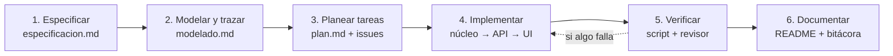

# Uso de IA: agentes y skills con desarrollo orientado a especificaciones (SDD)

La guía técnica permite y espera el uso de IA, con una condición: **el equipo es el auditor**.
Código que no podamos explicar, trazar y verificar no se entrega. Este documento cuenta cómo
organizamos la IA para cumplir esa condición.

Herramienta usada: **Claude Code** (asistente de programación de Anthropic) dentro del repositorio.

## 1. ¿Qué es SDD, en palabras simples?

**SDD (Spec-Driven Development, desarrollo orientado a especificaciones)** significa:
*primero se escribe y se aprueba qué debe hacer el sistema; después se programa exactamente eso.*

¿Por qué sirve con IA? Porque la IA es rápida pero puede inventar cosas que nadie pidió.
Con una especificación escrita:

- La IA recibe instrucciones **precisas** (criterios `CA-01` a `CA-16`), no ideas vagas.
- Nosotros podemos **comparar** lo que produjo contra lo que se pidió, criterio por criterio.
- El script de aceptación sale directamente de los criterios: cada `CA` tiene su prueba.

## 2. Las tres piezas que administramos

| Pieza | Qué es | Dónde está | Para qué la usamos |
|-------|--------|------------|--------------------|
| **Arnés** | Reglas que la IA lee siempre al trabajar en el repositorio | [`CLAUDE.md`](../../CLAUDE.md) | Prohibiciones (bibliotecas externas, NetworkX solo para dibujar) y orden de trabajo |
| **Skills** | Recetas paso a paso para una tarea que se repite | [`.claude/skills/`](../../.claude/skills) | Que cada feature se construya igual, sin olvidar pasos |
| **Agentes** | Asistentes especializados con permisos limitados | [`.claude/agents/`](../../.claude/agents) | Revisar y explicar, separados de quien escribe el código |

### 2.1 Arnés: `CLAUDE.md`

Es el "reglamento" que se carga en cada sesión. Traduce la guía técnica a reglas concretas:
qué bibliotecas están prohibidas, en qué archivo puede aparecer NetworkX, el orden
núcleo → API → interfaz → pruebas, y las convenciones de ramas y commits.
Sin este archivo habría que repetirle las reglas a la IA en cada conversación.

### 2.2 Skills

| Skill | Cuándo se activa | Qué garantiza |
|-------|------------------|---------------|
| [`sdd-feature`](../../.claude/skills/sdd-feature/SKILL.md) | "Planear / implementar la feature N" | Las 5 fases del SDD en orden y la lista de prohibiciones |
| [`prueba-aceptacion`](../../.claude/skills/prueba-aceptacion/SKILL.md) | "Crear o ejecutar pruebas de aceptación" | Solo `urllib`, escenarios mínimos de la guía y formato *esperado / obtenido / PASÓ* |

Las skills son reutilizables: en las Features 2, 3 y 4 se usan las mismas recetas.

### 2.3 Agentes

| Agente | Permisos | Rol |
|--------|----------|-----|
| [`revisor-reglas`](../../.claude/agents/revisor-reglas.md) | Solo lectura (`Read`, `Grep`, `Glob`) | Audita el código contra la guía técnica y la especificación antes del PR |
| [`trazador-grafos`](../../.claude/agents/trazador-grafos.md) | Solo lectura | Produce trazas manuales paso a paso para la documentación y el pitch |

**Idea clave:** quien escribe el código no es quien lo aprueba. El agente revisor no puede editar
archivos, solo reportar; y después de él, un integrante humano revisa el Pull Request.

## 3. Cómo se aplicó en la Feature 1

| Fase SDD | Qué hizo la IA | Qué hizo el equipo (control humano) | Evidencia |
|----------|----------------|-------------------------------------|-----------|
| 1. Especificar | Propuso historias, reglas R-01 a R-08 y criterios CA-01 a CA-16 a partir del brief | Revisar que cada criterio salga del brief y no agregue alcance | [`especificacion.md`](../feature-1/especificacion.md), PR de especificación |
| 2. Modelar | Propuso grafo dirigido + lista de adyacencia y la traza manual | Rehacer la traza a mano y comparar con el código | [`modelado.md`](../feature-1/modelado.md) |
| 3. Planear | Dividió el trabajo en tareas T1–T10, una rama y un PR por tarea | Asignar responsables reales y crear los issues | [`plan.md`](../feature-1/plan.md) |
| 4. Implementar | Escribió núcleo, API, visualización e interfaz, en ese orden, en commits pequeños | Leer cada commit y poder explicarlo en el pitch | Historial de los PR de `feature/1-nucleo-red`, `feature/1-api-rest` y `feature/1-visualizacion-interfaz` |
| 5. Verificar | Escribió y ejecutó el script (37/37); el agente `revisor-reglas` auditó el código | Ejecutar el script en su propio equipo y probar la interfaz | [`salida`](../../pruebas/salidas/aceptacion_feature1.txt), revisión del PR |
| 6. Documentar | Redactó README, bitácora y guion del pitch | Corregir lo que no se entienda y ensayar el pitch | Este documento |

## 4. Reglas que seguimos con la IA

1. **Nada sin especificación:** si algo no está en `especificacion.md`, no se programa (o se agrega primero a la especificación).
2. **Todo se verifica:** una propuesta solo se acepta si pasa el script de aceptación y la podemos explicar.
3. **Todo se registra:** cada decisión importante va a la [bitácora](bitacora-feature-1.md), también las propuestas **rechazadas**.
4. **Permisos mínimos:** los agentes de revisión son de solo lectura.
5. **Nada se comparte entre equipos:** ni prompts ni código (regla de la guía técnica).

## 5. Cómo reutilizarlo en la siguiente feature

1. Pedir a Claude Code: *"Usa la skill sdd-feature para especificar la Feature 2"*.
2. Revisar y aprobar `docs/feature-2/especificacion.md` en un PR antes de programar.
3. Implementar en `feature/2-cobertura`, ejecutar el script nuevo y pedir: *"Revisa con el agente revisor-reglas"*.
4. Actualizar `docs/ia/bitacora-feature-2.md`.
