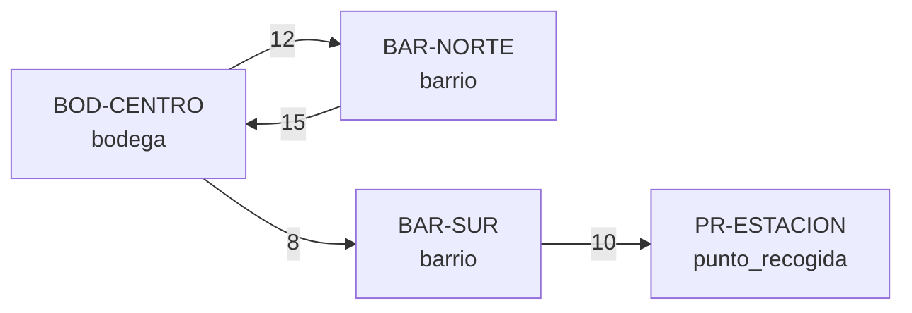

# Feature 1 — Modelado del grafo

## 1. Del negocio al grafo

| Concepto del negocio | Elemento del grafo | Ejemplo |
|----------------------|--------------------|---------|
| Bodega, barrio o punto de recogida | **Nodo** (vértice) con atributo `tipo` | `BOD-CENTRO` (bodega) |
| Trayecto disponible de un punto a otro | **Arista dirigida** `origen → destino` | `BOD-CENTRO → BAR-NORTE` |
| Tiempo estimado del trayecto | **Peso** de la arista (`costo`) | `12` minutos |

Resultado: un **grafo dirigido, ponderado, con pesos positivos y sin lazos**.

## 2. ¿Por qué la red es dirigida?

La pregunta clave del brief: *¿una conexión A→B siempre permite B→A?* **No.**

- **Calles de un solo sentido:** un camión puede ir de la bodega al barrio por una vía que no permite regresar.
- **Costos distintos de ida y vuelta:** subir una loma cargado no tarda lo mismo que bajarla.
  En el ejemplo, `BOD-CENTRO → BAR-NORTE` cuesta 12 min y `BAR-NORTE → BOD-CENTRO` cuesta 15 min.
- **Accesos restringidos:** un punto de recogida puede recibir pedidos pero no despachar hacia otro lado.

Si usáramos un grafo no dirigido, el sistema podría "inventar" un regreso que no existe y enviar un
pedido por una conexión cerrada, que es justo el problema que tiene hoy RutaPyme.

## 3. ¿Qué representa el peso?

El peso `costo` es el **tiempo estimado del trayecto en minutos**. Debe ser **mayor que 0** porque:

1. Ningún trayecto real tarda 0 minutos o un tiempo negativo.
2. En la Feature 3 se calculará la ruta de menor costo; los algoritmos clásicos para eso
   (como Dijkstra) necesitan pesos no negativos para dar la respuesta correcta.

El campo se llama `costo` (y no `minutos`) para que el cliente pueda cambiar a distancia en km
sin modificar la API; solo cambia la interpretación.

## 4. Representación principal: lista de adyacencia

La segunda pregunta del brief: *¿qué operación haremos más: consultar todos los vecinos de un
punto o revisar cualquier posible pareja?* En las Features 2 y 3, los recorridos y el cálculo de
rutas preguntan una y otra vez **"¿a dónde puedo ir desde este punto?"**. Esa es la operación
principal, y la lista de adyacencia la resuelve mirando solo los vecinos reales.

En `backend/red.py` la red se guarda en dos diccionarios:

```python
self._tipos = {"BOD-CENTRO": "bodega", "BAR-NORTE": "barrio", ...}
self._adyacencia = {
    "BOD-CENTRO": {"BAR-NORTE": 12, "BAR-SUR": 8},   # salidas de BOD-CENTRO con su costo
    "BAR-NORTE":  {"BOD-CENTRO": 15},
    ...
}
```

Las salidas de cada punto se guardan en un diccionario interno (y no en una lista) para detectar
una conexión duplicada al instante.

### Comparación con la matriz de adyacencia

`V` = número de puntos, `E` = número de conexiones, `grado(p)` = número de salidas del punto `p`.

| Operación | Lista de adyacencia (elegida) | Matriz de adyacencia |
|-----------|-------------------------------|----------------------|
| Vecinos de un punto (operación principal) | **O(grado(p))** | O(V): hay que revisar toda la fila |
| ¿Existe A→B? (validar duplicado) | O(1) promedio (diccionario) | O(1) |
| Agregar un punto | O(1) | O(V) o más: crecer filas y columnas |
| Agregar una conexión | O(1) promedio | O(1) |
| Listar toda la red | O(V + E) | O(V²) |
| Memoria | **O(V + E)** | O(V²) |

La red de una pyme es **dispersa**: cada punto se conecta con pocos puntos cercanos, así que
`E` es mucho menor que `V²`. La matriz gastaría memoria en casillas vacías y haría más lentos los
recorridos. Por eso la lista de adyacencia es la representación principal.

## 5. Ejemplo pequeño



## 6. Traza manual del registro

Se parte de una red vacía. Cada fila muestra la operación, cómo queda la lista de adyacencia y la
decisión que toma `backend/red.py`.

| Paso | Operación | Lista de adyacencia después | Decisión |
|------|-----------|-----------------------------|----------|
| 1 | Punto `BOD-CENTRO` (bodega) | `BOD-CENTRO: {}` | Aceptado (201): id válido y nuevo |
| 2 | Punto `bar-norte` (barrio) | `BOD-CENTRO: {}`, `BAR-NORTE: {}` | Aceptado: se normaliza a `BAR-NORTE` |
| 3 | Punto `BAR-NORTE` (barrio) | sin cambios | **Rechazado (409)**: el id ya existe |
| 4 | Puntos `BAR-SUR` y `PR-ESTACION` | se agregan con `{}` | Aceptados |
| 5 | Conexión `BOD-CENTRO → BAR-NORTE`, 12 | `BOD-CENTRO: {BAR-NORTE: 12}` | Aceptada: ambos existen, costo > 0, par nuevo |
| 6 | Se consulta `BAR-NORTE` | `BAR-NORTE: {}` | No tiene salidas: A→B **no** creó B→A |
| 7 | Conexión `BAR-NORTE → BOD-CENTRO`, 15 | `BAR-NORTE: {BOD-CENTRO: 15}` | Aceptada: es otro par (dirigido) |
| 8 | Conexión `BOD-CENTRO → BAR-NORTE`, 20 | sin cambios | **Rechazada (409)**: el par ya existe |
| 9 | Conexión `BOD-CENTRO → BAR-OESTE`, 5 | sin cambios | **Rechazada (404)**: `BAR-OESTE` no existe |
| 10 | Conexión `BOD-CENTRO → BAR-SUR`, 0 | sin cambios | **Rechazada (400)**: el costo debe ser > 0 |
| 11 | Conexión `BOD-CENTRO → BAR-SUR`, 8 | `BOD-CENTRO: {BAR-NORTE: 12, BAR-SUR: 8}` | Aceptada |
| 12 | Conexión `BAR-SUR → PR-ESTACION`, 10 | `BAR-SUR: {PR-ESTACION: 10}` | Aceptada |

Orden de las validaciones en una conexión (primero lo más barato de revisar):
**costo válido → formato de origen y destino → origen existe → destino existe → origen ≠ destino → par no repetido**
(ver `RedOperativa.agregar_conexion` en `backend/red.py`).
Todas son O(1), así que registrar una conexión es O(1) en promedio.

## 7. Red de ejemplo sintética

`datos/red_ejemplo.json` trae 7 puntos y 10 conexiones inventadas. Incluye a propósito:

- Un par ida/vuelta con costos distintos (`BOD-CENTRO ⇄ BAR-NORTE`: 12 y 15).
- Un ciclo (`BAR-SUR → BAR-ORIENTE → BAR-SUR`).
- Un camino directo caro (`BOD-CENTRO → PR-ESTACION`, 30) frente a uno de más saltos pero más
  barato (`BOD-CENTRO → BAR-SUR → PR-ESTACION`, 8 + 10 = 18), útil para la Feature 3.
- Un punto sin conexiones de entrada (`PR-LAGUNA`), útil para explicar "no alcanzable" en la Feature 2.
