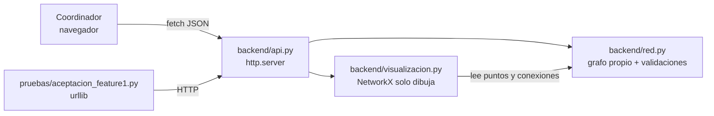

# Feature 1 — Plan técnico

## 1. ¿Local o desplegado en una instancia gratuita?

| Criterio | Local (`python main.py`) | Instancia gratuita (ej. Render Free) |
|----------|--------------------------|--------------------------------------|
| Lo exige la guía | **Sí**: "script de aceptación contra la API local" | No |
| Instalación | venv + `pip install -r requirements.txt` | Cuenta, conectar GitHub, configurar servicio |
| Tiempo de arranque | Inmediato | 30–60 s si el servicio estaba dormido |
| Datos en memoria | Se conservan mientras el servidor esté encendido | Se pierden cada vez que el servicio se duerme |
| Riesgo en la demo | Bajo (no depende de internet) | Medio (red del salón, servicio dormido) |

**Decisión:** el proyecto se desarrolla, prueba y demuestra **en local**. Es lo más simple y lo que
pide la guía. Aun así, el servidor ya lee `HOST` y `PORT` del entorno y el repositorio incluye
`render.yaml`, así que publicarlo en Render Free es opcional y toma unos minutos si en la
Feature 4 se quiere un enlace público (ver README → "Despliegue opcional").

## 2. Arquitectura

| Capa | Archivo | Responsabilidad | Bibliotecas |
|------|---------|-----------------|-------------|
| Núcleo | `backend/red.py` | Grafo (lista de adyacencia) y reglas de validación | Estándar (`re`, `math`) |
| API | `backend/api.py` | Rutas REST, lectura de JSON, códigos HTTP | Estándar (`http.server`, `json`) |
| Visualización | `backend/visualizacion.py` | Dibujar la red ya construida como PNG | `networkx`, `matplotlib` |
| Arranque | `main.py` | Iniciar el servidor, cargar ejemplo opcional | Estándar (`argparse`, `os`) |
| Interfaz | `frontend/` | Formularios, tablas y dibujo; consume la API | HTML, CSS, JS nativos |
| Pruebas | `pruebas/aceptacion_feature1.py` | Escenarios de aceptación contra la API | Estándar (`urllib`) |

¿Por qué `http.server` y no Flask/FastAPI? La guía y el equipo acordaron no agregar bibliotecas
externas al backend. `http.server` viene con Python, alcanza para una API pequeña y obliga a
entender cómo funciona HTTP (método, ruta, código de estado, cuerpo).

## 3. Tareas (backlog de la Feature 1)

Cada tarea es un *issue* en GitHub. Responsables propuestos; el equipo puede reasignarlos.

| # | Tarea | Criterios | Responsable | Rama |
|---|-------|-----------|-------------|------|
| T1 | Especificación, modelado y plan (SDD) | CA-16 | Emmanuel Cardona y Sebastian Ramirez | `docs/feature-1-especificacion` |
| T2 | Núcleo del grafo y validaciones (`red.py`) | CA-01 a CA-10 | Sebastian Ramirez | `feature/1-red-operativa` |
| T3 | API REST con `http.server` | CA-11 a CA-13 | Sebastian Ramirez | `feature/1-red-operativa` |
| T4 | Visualización con NetworkX | CA-15 | Emmanuel Cardona | `feature/1-red-operativa` |
| T5 | Interfaz web mínima | CA-14 | Emmanuel Cardona | `feature/1-red-operativa` |
| T6 | Script de aceptación y evidencia | todos | Emmanuel Cardona | `feature/1-red-operativa` |
| T7 | README, bitácora IA y guion del pitch | CA-16 | Sebastian Ramirez | `feature/1-red-operativa` |
| T8 | Revisión cruzada de PR | — | quien no sea autor del PR | — |
| T9 | Pitch en clase | — | integrante asignado al pitch | — |

> El docente indicó que **no se requiere video**: la demostración se hace en la exposición en clase.

## 4. Flujo en GitHub

1. `main` solo recibe cambios por Pull Request.
2. PR 1: `docs/feature-1-especificacion` → `main` (especificación aprobada antes de programar).
3. PR 2: `feature/1-red-operativa` → `main` (núcleo, API, interfaz, pruebas y documentación).
4. Cada PR usa la plantilla, enlaza sus issues y lo revisa el otro integrante.
5. Al fusionar el PR 2: tag `v1.0.0` y release "Feature 1 — Red operativa inicial" con la salida
   del script de aceptación.

## 5. Riesgos y cómo se manejan

| Riesgo | Mitigación |
|--------|-----------|
| Se reinicia el servidor y se pierde la red | Botón / endpoint para cargar la red de ejemplo |
| NetworkX no está instalado | La API sigue funcionando; solo la imagen responde 503 con un mensaje claro |
| Alguien agrega una biblioteca prohibida | Agente `revisor-reglas` y checklist en la plantilla de PR |
| El navegador deja conexiones abiertas | Servidor con hilos (`ThreadingHTTPServer`) y un candado para proteger la red |
